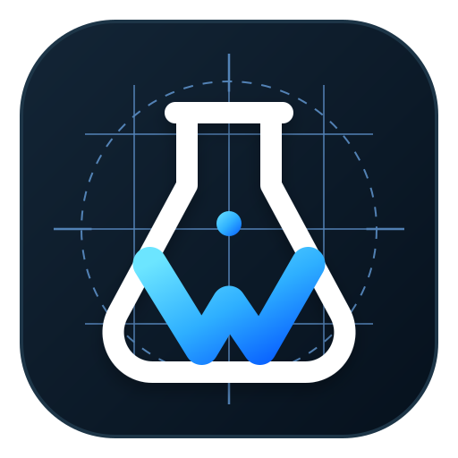
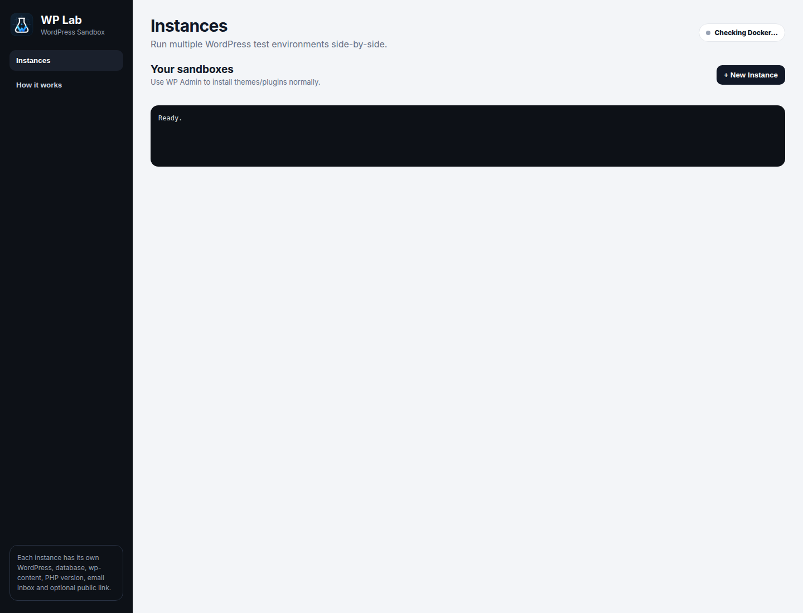
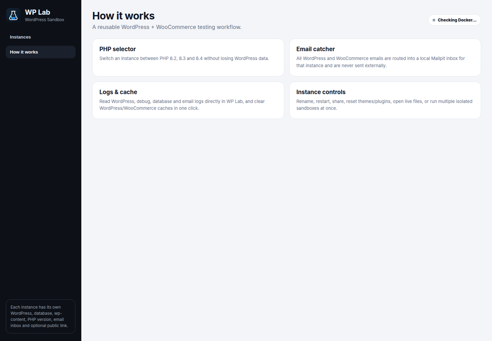

# WP Lab

<p align="center">
  
</p>

<h3 align="center">Disposable WordPress + WooCommerce sandboxes for Linux</h3>

<p align="center">
  Run multiple isolated WordPress test sites side-by-side, switch PHP versions, inspect logs and email, share temporary client previews, and reset a sandbox without rebuilding your machine.
</p>

<p align="center">
  <strong>Current version: 0.8.0</strong> · Linux desktop app · Docker-powered
</p>



## Why WP Lab?

WP Lab is built for WordPress developers who repeatedly need a clean place to test themes, plugins, WooCommerce flows, fixes, and client changes.

Instead of maintaining one messy local WordPress install, WP Lab gives each sandbox its own WordPress site, database, files, PHP version, email inbox, ports, and optional public preview link.

## Highlights

- **Multiple isolated instances** — run several WordPress/WooCommerce sandboxes at the same time.
- **Normal WP Admin workflow** — install themes and plugins directly from WordPress instead of uploading ZIPs through WP Lab.
- **PHP switching** — move an instance between PHP **8.2, 8.3, and 8.4** while preserving its WordPress data.
- **Live site snapshots** — each instance card shows a cached frontend screenshot with manual refresh.
- **Built-in email catcher** — WordPress and WooCommerce mail is captured locally with Mailpit instead of being sent externally.
- **Logs inside WP Lab** — inspect WordPress/Apache, `debug.log`, database, and email-catcher logs.
- **One-click cache clearing** — flush WordPress cache, transients, and relevant WooCommerce caches.
- **Instance controls** — rename, start/repair, stop, restart, delete, and reset themes/plugins.
- **Demo content** — quickly seed sample blog posts, WooCommerce products, and orders.
- **Open local files** — jump straight into the instance files from WP Lab.
- **Temporary client links** — create an HTTPS preview using Cloudflare Tunnel, then stop sharing when finished.
- **WooCommerce test setup** — includes a WP Lab dummy gateway with success, failed, pending, and on-hold outcomes, plus COD/bank transfer and test shipping configuration.

## More screenshots

### Built-in workflow guide



## How it works

Each sandbox is isolated using Docker Compose. WP Lab assigns separate ports and persistent data for WordPress, the database, and Mailpit, then manages the environment from one desktop interface.

The first instance starts at:

- WordPress: `http://localhost:8085`
- WP Admin: `http://localhost:8085/wp-admin`
- WP Lab UI: `http://localhost:4173`

Additional instances receive their own ports automatically.

Default local WordPress credentials are:

```text
Username: admin
Password: admin
```

These credentials are intentionally simple because WP Lab is designed for **local disposable development environments only**.

## Requirements

- Linux — tested around Ubuntu / Linux Mint style desktop environments
- Node.js 20+
- npm
- Docker Engine
- Docker Compose plugin
- Google Chrome or Chromium for automatic live preview thumbnails

The bundled/public-preview workflow also uses Cloudflare Tunnel support.

## Run from source

```bash
git clone https://github.com/haseebgb92/WP-Lab.git
cd WP-Lab
npm install
npm start
```

Then open:

```text
http://localhost:4173
```

To run the Electron desktop shell:

```bash
npm run app
```

## Build the Linux package

```bash
npm install
npm run build:linux
```

The generated Debian package is written to the `dist/` directory.

## Docker setup on Ubuntu / Linux Mint

A typical Docker installation is:

```bash
sudo apt update
sudo apt install -y docker.io docker-compose-v2
sudo usermod -aG docker "$USER"
```

Log out and back in once so the Docker group change takes effect.

If `docker-compose-v2` is unavailable in your distribution repository, install Docker Engine and the Compose plugin from Docker's official repository.

## Typical workflow

1. Create a new instance and give it a useful name.
2. Open **WP Admin**.
3. Install the theme/plugins you want to test normally.
4. Add demo content when useful.
5. Test against PHP 8.2, 8.3, or 8.4.
6. Inspect logs, captured mail, frontend snapshots, and WooCommerce behavior.
7. Create a temporary **Client Link** when someone else needs to review the site.
8. Restart, clear caches, reset themes/plugins, or delete the sandbox when finished.

## Safety

WP Lab is a development tool, not a production hosting stack.

- Do not expose the default WordPress credentials directly to the public Internet.
- Treat temporary client links as short-lived review URLs.
- Do not use the dummy payment gateway for real transactions.
- Keep production secrets and customer data out of disposable test instances.

## Project status

WP Lab is actively evolving. Version **0.8.0** focuses on making local WordPress testing feel more like managing lightweight disposable environments than manually maintaining separate local installs.

Issues and practical improvement ideas are welcome through GitHub Issues.

---

Built by **Advertpreneur** for faster WordPress and WooCommerce development workflows.
